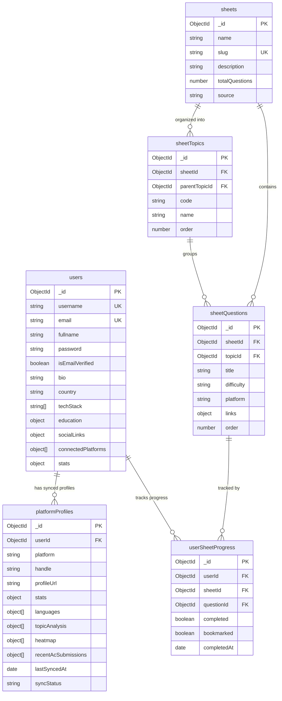

<div align="center">

# 🦊 Kompile

**Your all-in-one competitive programming & development dashboard.**

A full-stack platform that aggregates stats from LeetCode, Codeforces, and GitHub, tracks DSA sheet progress, surfaces upcoming contest alerts, and provides curated company-wise question kits — keeping your entire coding journey in one place.

[](https://reactjs.org/)
[](https://vitejs.dev/)
[](https://nodejs.org/)
[](https://expressjs.com/)
[](https://www.mongodb.com/)
[](https://tailwindcss.com/)
[](LICENSE)

[Features](#-features) · [Tech Stack](#-tech-stack) · [API Routes](#-api-reference) · [Database](#-database-schema) · [Getting Started](#-getting-started)

</div>

---

## 📌 Problem Statement

Developers and competitive programmers often juggle 4–5 different tabs just to check their stats — LeetCode for DSA progress, Codeforces for ratings, GitHub for contributions, and multiple sites for upcoming contests.

**Kompile** solves this by providing a unified platform for live tracking, instant alerts, and complete visibility into your coding journey — all from a single dashboard.

---

## ✨ Features

| Feature | Description |
|---|---|
| 🧑‍💻 **Profile Dashboard** | Aggregates stats from LeetCode, Codeforces, and GitHub into a unified profile with difficulty breakdowns, contest ratings, heatmaps, and recent submissions |
| 📅 **Contest Calendar** | Never miss a contest — pulls upcoming events from Codeforces, AtCoder, CodeChef, GeeksforGeeks, and more with one-click "Add to Calendar" |
| 📚 **DSA Sheets** | Full-featured sheet tracker (Striver A2Z, Love Babbar, etc.) with per-question completion toggling, bookmarking, and topic-level progress bars |
| 🏢 **Company-Wise Kits** | Curated question sets for top companies like Google, Amazon, Meta, and Microsoft — filterable by difficulty, topic, and platform |
| 📊 **Dev Stats** | Syncs with GitHub to display language usage, commit history, PRs, stars, and contribution streaks |
| 🔐 **Full Auth System** | Email/password registration with email verification, JWT access + refresh token rotation, and forgot/reset password flows |
| 🪪 **Kompile Card** | A shareable public developer card that aggregates your scores and serves as your verified coding identity |

---

## 🛠 Tech Stack

### Frontend

| Technology | Purpose |
|---|---|
| **React 18** | UI library with hooks-based state management |
| **Vite** | Lightning-fast dev server and bundler |
| **React Router v6** | Client-side routing with nested layouts |
| **Tailwind CSS** | Utility-first CSS framework |
| **Axios** | HTTP client with a custom `axiosInstance` (base URL + credentials) |
| **Lucide React** | Icon library |

### Backend

| Technology | Purpose |
|---|---|
| **Node.js + Express** | REST API server |
| **MongoDB + Mongoose** | Primary database with schema validation |
| **JSON Web Tokens (JWT)** | Stateless auth — short-lived access tokens + refresh token rotation |
| **bcrypt** | Password hashing |
| **cookie-parser** | HttpOnly cookie handling for refresh tokens |
| **express-validator** | Request body validation middleware |
| **Nodemailer** | Email delivery for verification and password reset |

### External APIs

| Platform | Data Fetched |
|---|---|
| **LeetCode** (GraphQL) | Total solved, difficulty breakdown, contest rating, heatmap, recent AC submissions, topic analysis |
| **Codeforces** (REST) | Rating, contests attended, problems solved |
| **GitHub** (REST + GraphQL) | Contributions, commits, PRs, stars, language breakdown, streaks |

---

## 📡 API Reference

All routes are prefixed with `/api/v1`. Protected routes (✅) require a valid JWT in an `Authorization: Bearer <token>` header or HttpOnly cookie.

### Auth — `/api/v1/auth`

| Method | Endpoint | Auth | Description |
|---|---|---|---|
| `POST` | `/register` | ─ | Create a new account |
| `POST` | `/login` | ─ | Login — receive access + refresh tokens |
| `GET` | `/verify-email/:token` | ─ | Verify email address |
| `POST` | `/refresh-token` | ─ | Rotate access token using refresh token |
| `POST` | `/forgot-password` | ─ | Send password reset email |
| `POST` | `/reset-password/:token` | ─ | Set new password via reset token |
| `POST` | `/logout` | ✅ | Invalidate session and clear tokens |
| `GET` | `/current-user` | ✅ | Get the currently authenticated user |
| `POST` | `/change-password` | ✅ | Change password (requires current password) |
| `POST` | `/resend-email-verification` | ✅ | Resend the verification email |

### Users — `/api/v1/users`

| Method | Endpoint | Auth | Description |
|---|---|---|---|
| `GET` | `/profile/:username` | ─ | Get full public profile by username |
| `GET` | `/get-basic-info` | ✅ | Get own basic profile info |
| `GET` | `/get-basic-info/:username` | ─ | Get basic info for any user |
| `PUT` | `/update-basic-info` | ✅ | Update bio, education, socials, tech stack |
| `GET` | `/stats` | ✅ | Get own aggregated platform stats |

### Platforms — `/api/v1/platforms`

| Method | Endpoint | Auth | Description |
|---|---|---|---|
| `POST` | `/sync/leetcode` | ✅ | Sync LeetCode profile data |
| `POST` | `/sync/codeforces` | ✅ | Sync Codeforces profile data |
| `POST` | `/sync/github` | ✅ | Sync GitHub profile data |
| `POST` | `/sync/all` | ✅ | Sync all connected platforms at once |
| `GET` | `/stats` | ✅ | Get aggregated stats across all platforms (own) |
| `GET` | `/stats/:username` | ─ | Get aggregated stats for any user |
| `GET` | `/:platform` | ✅ | Get data for a specific platform (own) |
| `GET` | `/:platform/:username` | ─ | Get platform data for any user |

### Sheets — `/api/v1/sheets`

All sheet routes require authentication.

| Method | Endpoint | Description |
|---|---|---|
| `GET` | `/` | List all sheets with the user's overall progress |
| `GET` | `/:slug` | Get sheet details — topics, questions, and per-question progress |
| `PATCH` | `/:sheetId/questions/:questionId/toggle` | Toggle question completion (done ↔ undone) |
| `PATCH` | `/:sheetId/questions/:questionId/bookmark` | Toggle question bookmark |

---

## 🗄 Database Schema

Kompile uses **MongoDB** with 6 core collections. The core design principle is **shared master data, sparse user data** — questions are stored once; per-user state (completion, bookmarks) only creates a document when a user interacts with it.



### Collection Summary

| Collection | Written By | Key Index |
|---|---|---|
| `users` | Auth flow, profile edits | `username`, `email` (unique) |
| `platformProfiles` | Platform sync jobs (upsert) | `{ userId, platform }` unique compound |
| `sheets` | Admin / seed scripts | `slug` (unique) |
| `sheetTopics` | Admin / seed scripts | `{ sheetId, parentTopicId, order }` |
| `sheetQuestions` | Admin / seed scripts | `{ sheetId, order }` |
| `userSheetProgress` | User question interactions | `{ userId, questionId }` unique compound |

> **Sparse progress pattern:** `userSheetProgress` is never pre-populated for all questions. A document is created only when a user first marks a question done or bookmarks it — storage stays proportional to actual usage, not the total question bank size.

---

## 🚀 Getting Started

### Prerequisites

- Node.js ≥ 18
- MongoDB (local or Atlas URI)
- npm

### 1. Clone the repository

```bash
git clone https://github.com/your-username/Kompile.git
cd Kompile
```

### 2. Configure the server

```bash
cd server
cp .env.example .env
```

Update `.env` with your values:

```env
PORT=8000
MONGODB_URI=mongodb://localhost:27017/kompile
CORS_ORIGIN=http://localhost:5173

ACCESS_TOKEN_SECRET=your_access_token_secret
ACCESS_TOKEN_EXPIRY=15m
REFRESH_TOKEN_SECRET=your_refresh_token_secret
REFRESH_TOKEN_EXPIRY=7d

# Email (Nodemailer)
SMTP_HOST=smtp.example.com
SMTP_PORT=587
SMTP_USER=you@example.com
SMTP_PASS=your_smtp_password
```

### 3. Configure the client

```bash
cd ../client
cp .env.example .env
```

```env
VITE_API_BASE_URL=http://localhost:8000/api/v1
```

### 4. Install dependencies & run

```bash
# Terminal 1 — API server
cd server && npm install && npm run dev

# Terminal 2 — Frontend
cd client && npm install && npm run dev
```

| Service | URL |
|---|---|
| Frontend | http://localhost:5173 |
| API | http://localhost:8000/api/v1 |
| Healthcheck | http://localhost:8000/api/v1/healthcheck |

---

## 📁 Project Structure

```
Kompile/
├── client/                      # React + Vite frontend
│   └── src/
│       ├── api/                 # Axios instance & per-feature API modules
│       │   ├── axiosInstance.js
│       │   ├── auth.api.js
│       │   ├── sheets.api.js
│       │   └── platformApi.js
│       ├── components/          # Reusable & feature-specific components
│       │   ├── workspace/       # DSA sheet workspace UI
│       │   ├── CompanyWiseKit/  # Company kit UI
│       │   └── Profile/         # Profile page components
│       ├── pages/               # Route-level page components
│       │   ├── auth/
│       │   ├── Workspace/
│       │   ├── profile/
│       │   ├── CompanyWiseKit/
│       │   └── event/
│       └── context/             # React context providers
│
└── server/                      # Express + MongoDB backend
    └── src/
        ├── controllers/         # Route handler logic
        ├── models/              # Mongoose schemas (User, PlatformProfile, Sheet, …)
        ├── routes/              # Express routers
        ├── middlewares/         # verifyJWT, validate, error handler
        ├── validators/          # express-validator rule sets
        ├── services/            # Platform sync services
        ├── transformers/        # Platform API response normalizers
        └── utils/               # ApiResponse, ApiError, asyncHandler
```

---

## 📄 License

Distributed under the **MIT License**. See [`LICENSE`](LICENSE) for details.

---

<div align="center">

_Built for coders, by coders._

</div>
